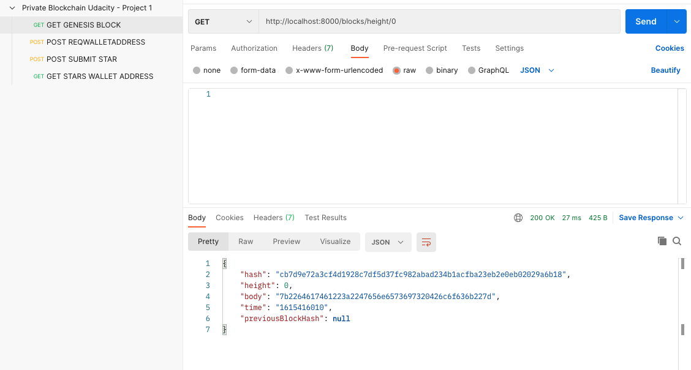
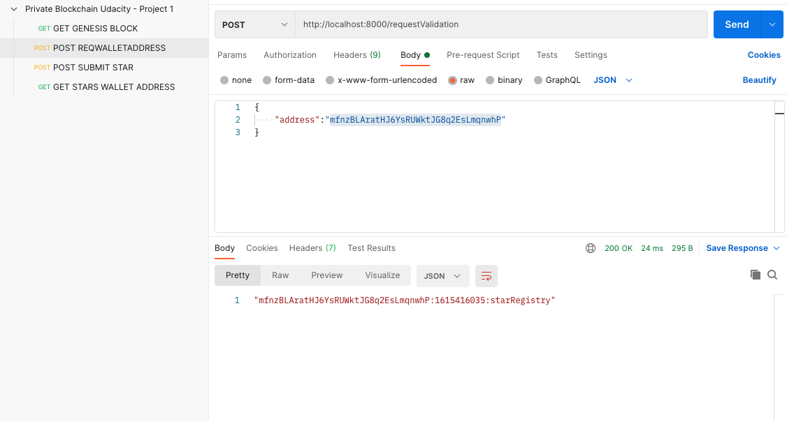
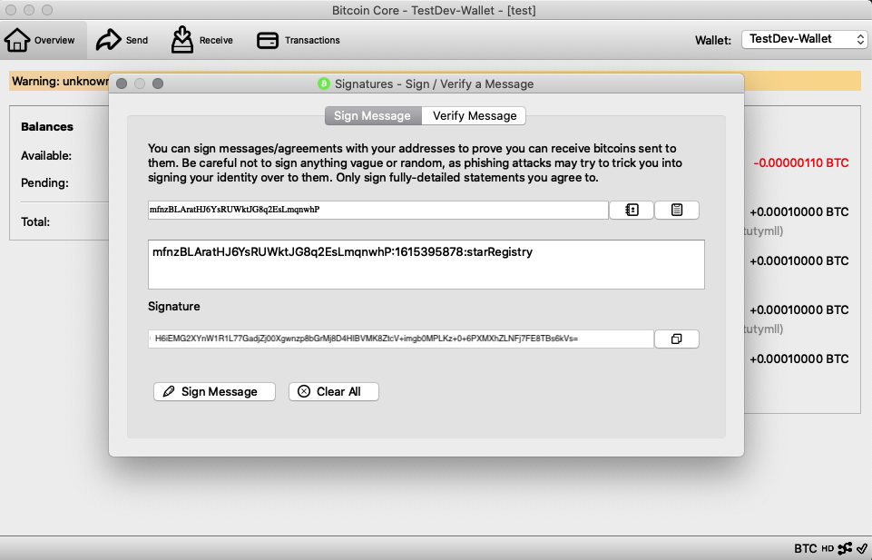
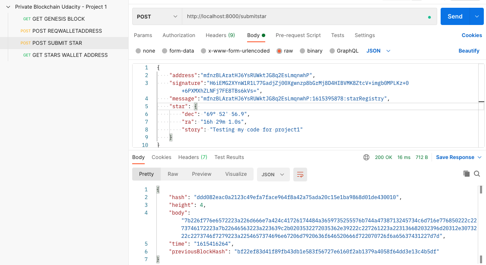
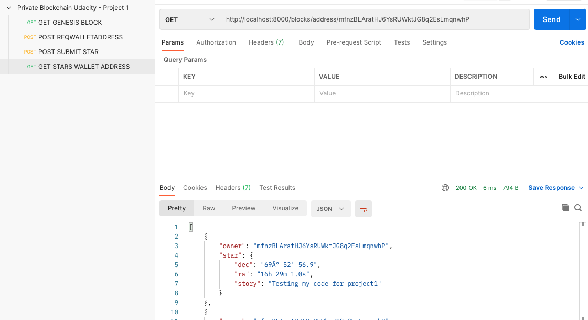

# Chapter 1: Blockchain Fundamentals


## The Basics of Blockchain
In the first chapter of the course, I learned the basics of blockchain technology, managing transactions, Bitcoin core & testnet to test applications, managing data in lockchain like assets, etc. During this course, code exercises were in order to teach the fundamentals of creating your own private blockchain. These are the subfolders added to the repo. They all build up to eventuelly completing the first assignment.

**Exercises:**
* [Hash Key Introduction](/1.1%20Hash%20Key%20Introduction): hashing information with crypto-js.
* [Javascript Promises Introduction](/1.2%20Javascript%20Promises%20Introduction): Introduction to working with the 'promises' method.
* [Blockchain Practice Block](/1.3%20Blockchain%20Practice%20Block): Creating your first block with data.
* [Block Data Model](/1.4%20Block%20Data%20Model): Creating a simple blockchain with block data.
* [Encode Decode Files](/1.5%20Encode%20Decode%20Files): Encode and decode assets like images and add this data in a block to the blockchain.
* [ExpressJS Introduction](/1.6%20ExpressJS): An introduction to using [ExpressJS](https://expressjs.com/) to run your blockchain.

## Assignment: Create Your Own Private Blockchain
In this project, I created a private blockchain to record ownership of stars.  Built as an `express.js` app, I implemented the code in `src/block.js` and `src/blockchain.js` that provides the functionality of validating a block on the blockchain, decoding the block, and constructing a chain of blocks that can be signed with an Bitcore wallet.  The project also exposes endpoints to search for blocks by block height, block hash, and by the address of the wallet that signed the block. I tested the application with API calls in POSTMAN.

Find the project here: [Blockchain Fundamentals](/Project%201%20-%20Private%20Blockchain%20Assignment).

### Purpose
The purpose of this project is to develop familiarity with the following concepts:

- Block
- Blockchain
- Wallet
- Blockchain Identity
- Proof of Existence
- Digital Assets

### Testing The App
The project is build as an `express.js` app with endpoints that are defined in `BlockchainController.js`.  To start the server, type 'npm start' in your terminal in your project folder. I used [POSTMAN](https://postman.com/) to test data in my local app. Alternativly, use the curl command.

####  Step 1: `getBlockByHeight`

Run the curl command below to test that the genesis block has been created:
```curl
curl --location --request GET 'http://localhost:8000/blocks/height/0'
```

The response will show that there is no previous block at height 0 and establish a genesis block hash that will be used in the generation of the subsequent block's hash.



####  Step 2: `requestOwnership`

This endpoint allows a user to generate a message to be signed with a wallet. I used a Bitcore wallet on the Testnet.  The message follows the format `<WALLET_ADDRESS>:<TIME>:starRegistry`.  The wallet address is the required input.  This address is required to perform subsequent steps.



**Verify your transaction with a digital signature in the Bitcore Testnet app:**



####  Step 3: `submitStar`

In this step, we submit a message signed by the wallet and put it on the private blockchain.  Since the digital signature proves owership of the wallet address, this message is guaranteed to have been signed by the owner of the wallet.  The content in "star" can be anything, but once added to the Blockchain it cannot be changed.  If an attempt were made to change any data in this block, subsequent blocks would not validate.



####  Step 4: `getStarsByWalletAddress`

Next, we show that blocks can also be filtered by the wallet address that signed the block.  To do this, we need to decode the encoded body of each block and check whether the address submitted in the endpoint request is a match.


