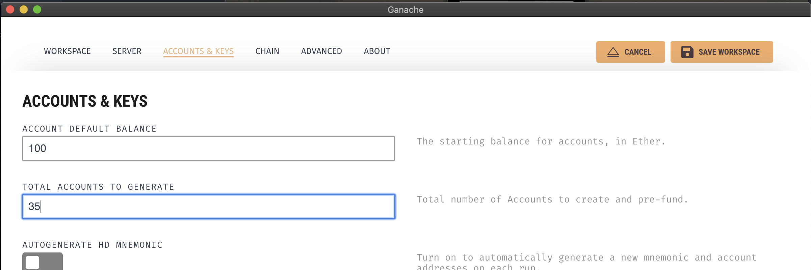
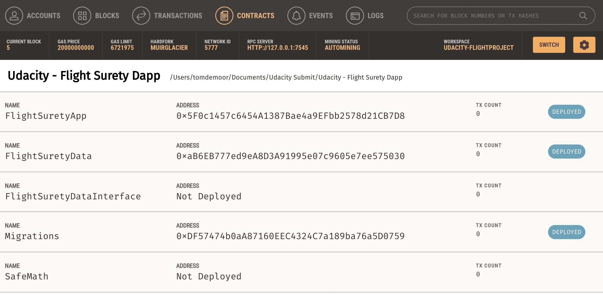
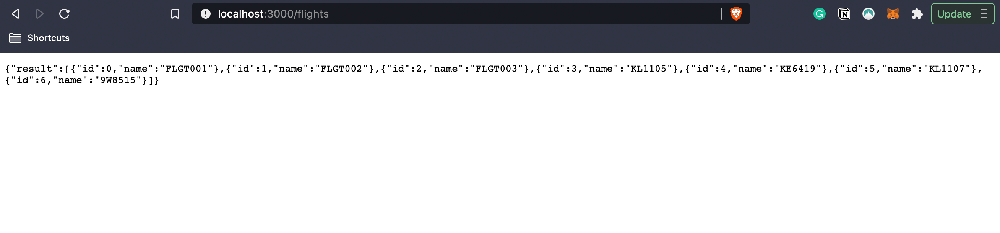
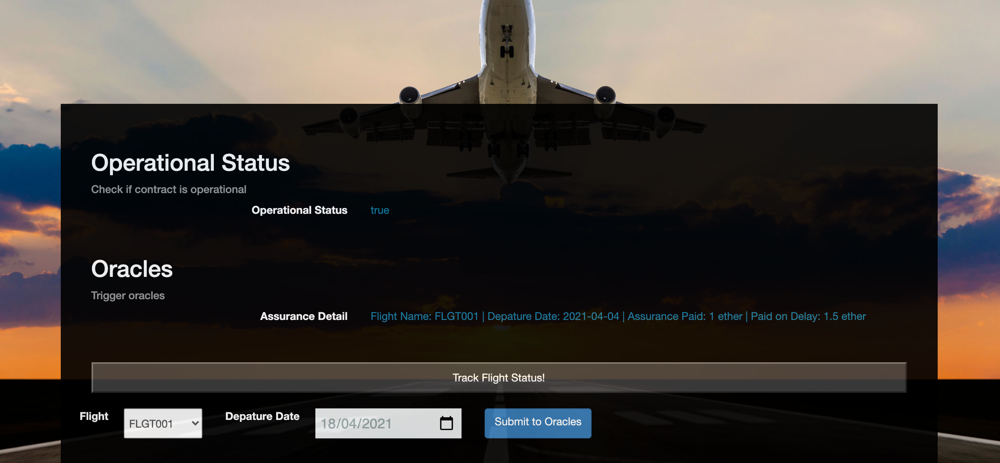
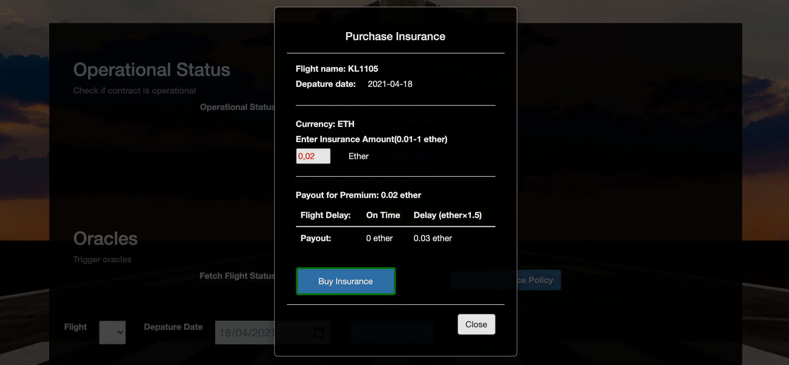

## Flight Surety Dapp Project - Udacity Blockchain Nanodegree

FlightSurety is a project for Udacity's Blockchain course on flight insurance. This project is based on the ethereum blockchain.

Features:
* Passengers can buy flight insurance
   * If flight is delayed they are credited 1.5 times the cost of the insurance. 
* 2 smart contracts
* 1 interface contract
* Multi-party consesus implementation
* Seperation of concerns as architectual pattern

> NOTE : The starter code of this project was modified so it functions with the latest Truffle & Web3 configurations. It follows an updated Solidity Compiler 0.6.5


#### Truffle, Solidity, Node & Web3 Version Info

```shell
Node v14.12.0
Web3.js v1.2.9
Truffle v5.1.61 (core: 5.1.61)
Solidity - 0.6.5 (solc-js)
```


#### Project Setup

1. Download this source code from the repository, extract the zip file & open terminal in root directory.
2. Run `npm install` to install all dependencies & dev dependencies.
3. Make sure your Truffle, Node, Solidity & Web3.Js **global** versions match as given above.
4. Run `truffle compile` to compile smart contracts
5. Run Ganache GUI tool, with 35 accounts configurations. (screenshot available below for ref.)
6. Run `truffle migrate` to deploy all contracts to Ganache powered ethereum blockchain
7. You can optionally run test cases now `truffle test ./test/flightSurety.js ` & `truffle test ./test/Oracles.js` 
8. To run server & register oracles, execute `npm run server`
9. To run dapp & test application, execute `npm run dapp`


#### Contract Compilation

```shell
$truffle compile

Compiling your contracts...
===========================
✔ Fetching solc version list from solc-bin. Attempt #1
✔ Downloading compiler. Attempt #1.
> Compiling ./contracts/DataInterfaceContract.sol
> Compiling ./contracts/FlightSuretyApp.sol
> Compiling ./contracts/FlightSuretyData.sol
> Compiling ./contracts/Migrations.sol
> Compiling ./node_modules/@openzeppelin/contracts/math/SafeMath.sol
> Artifacts written to /Users/tomdemoor/Documents/Udacity Submit/Udacity - Flight Surety Dapp/build/contracts
> Compiled successfully using:
   - solc: 0.6.5+commit.f956cc89.Emscripten.clang
```

#### Ganache Setup with 35 Accounts




#### Contract Migration

```shell
truffle migrate

Compiling your contracts...
===========================
> Everything is up to date, there is nothing to compile.

Starting migrations...
======================
> Network name:    'development'
> Network id:      5777
> Block gas limit: 6721975 (0x6691b7)

1_initial_migration.js
======================

   Deploying 'Migrations'
   ----------------------
   > transaction hash:    0x9fa974a30c8968ef0009b22cf7bdcdc7603d3075f93674f6772088465575dad4
   > Blocks: 0            Seconds: 0
   > contract address:    0xDF57474b0aA87160EEC4324C7a189ba76a5D0759
   > block number:        1
   > block timestamp:     1618696804
   > account:             0x14AAA223eEd6342a2Cc8A1991743016A651D92F3
   > balance:             99.9999615682
   > gas used:            192159 (0x2ee9f)
   > gas price:           0.2 gwei
   > value sent:          0 ETH
   > total cost:          0.0000384318 ETH


   > Saving migration to chain.
   > Saving artifacts
   -------------------------------------
   > Total cost:        0.0000384318 ETH


2_deploy_contract.js
====================

   Deploying 'FlightSuretyData'
   ----------------------------
   > transaction hash:    0x805249cc26035bafb13f053d98b5d633953fa997cc5ead9904ec77515ed04c3b
   > Blocks: 0            Seconds: 0
   > contract address:    0xaB6EB777ed9eA8D3A91995e07c9605e7ee575030
   > block number:        3
   > block timestamp:     1618696805
   > account:             0x14AAA223eEd6342a2Cc8A1991743016A651D92F3
   > balance:             99.999576975
   > gas used:            1880628 (0x1cb234)
   > gas price:           0.2 gwei
   > value sent:          0 ETH
   > total cost:          0.0003761256 ETH


   Deploying 'FlightSuretyApp'
   ---------------------------
   > transaction hash:    0xebe3faef6b4b006ad334afa6beb556d1ab34f31d5829d249b6fa09c8e33585db
   > Blocks: 0            Seconds: 0
   > contract address:    0x5F0c1457c6454A1387Bae4a9EFbb2578d21CB7D8
   > block number:        4
   > block timestamp:     1618696806
   > account:             0x14AAA223eEd6342a2Cc8A1991743016A651D92F3
   > balance:             99.998978188
   > gas used:            2993935 (0x2daf0f)
   > gas price:           0.2 gwei
   > value sent:          0 ETH
   > total cost:          0.000598787 ETH


   > Saving migration to chain.
   > Saving artifacts
   -------------------------------------
   > Total cost:        0.0009749126 ETH


Summary
=======
> Total deployments:   3
> Final cost:          0.0010133444 ETH
```

#### Deployed Contracts




#### Truffle Oracle Test Cases

```shell
truffle test ./test/Oracles.js 
Using network 'development'.


Compiling your contracts...
===========================
> Everything is up to date, there is nothing to compile.

  Contract: Oracles
Oracle Registered: 9, 8, 6
Oracle Registered: 3, 7, 2
Oracle Registered: 0, 7, 8
Oracle Registered: 5, 4, 9
Oracle Registered: 0, 5, 6
Oracle Registered: 3, 7, 4
Oracle Registered: 7, 1, 5
Oracle Registered: 7, 6, 3
Oracle Registered: 4, 3, 9
Oracle Registered: 5, 9, 0
Oracle Registered: 5, 4, 6
Oracle Registered: 5, 6, 9
Oracle Registered: 4, 8, 7
Oracle Registered: 5, 4, 9
Oracle Registered: 2, 8, 1
Oracle Registered: 3, 7, 4
Oracle Registered: 0, 4, 9
Oracle Registered: 3, 6, 0
Oracle Registered: 0, 6, 1
    ✓ can register oracles (7758ms)
    ✓ can request flight status (827ms)

  2 passing (9s)
```

#### Truffle Flight Surety Test Cases

```shell
truffle test ./test/flightSurety.js
Using network 'development'.

Compiling your contracts...
===========================
> Everything is up to date, there is nothing to compile.

  Contract: Testcases For Flight Surety Project
    ✓ Check for initial Operational Values (51ms)
    ✓ Access to changing operating status is blocked for non-contract owner account (485ms)
    ✓ Access to changing operating status is allowed for contract owner account (136ms)
    ✓ Contract functions work only when requireIsOperational status is true (342ms)
    ✓ Funding is neccessary for airline to be registered/operational (320ms)
    ✓ Test for multi-party consensus in registering new airline  (841ms)
    ✓ Airline has to submit 10 ETH fund to become operational (544ms)
    ✓ Multi-party consensus initiates onlt after a threshold  (1022ms)
    ✓ Passenger can buy inssurance for maximum of 1 ETH (186ms)
    ✓ Insured passenger can only be credited if flight is delayed
    ✓ Credited passenger can withdraw insured amount only (76ms)


  11 passing (5s)
```


#### Initializing Server & Oracle Registration

```shell
npm run server

> flightsuretydapp@1.0.0 server
> rm -rf ./build/server && webpack --config webpack.config.server.js

Hash: 95e75791765ac00fd661
Version: webpack 4.46.0
Time: 1982ms
Built at: 04/18/2021 12:16:32 AM
    Asset     Size  Chunks             Chunk Names
server.js  554 KiB       0  [emitted]  main
Entrypoint main = server.js
[0] multi webpack/hot/poll?1000 ./src/server/index 40 bytes {0} [built]
[./build/contracts/FlightSuretyApp.json] 1.32 MiB {0} [built]
[./node_modules/webpack/hot/log-apply-result.js] (webpack)/hot/log-apply-result.js 1.27 KiB {0} [built]
[./node_modules/webpack/hot/log.js] (webpack)/hot/log.js 1.34 KiB {0} [built]
[./node_modules/webpack/hot/poll.js?1000] (webpack)/hot/poll.js?1000 1.12 KiB {0} [built]
[./src/server/config.json] 180 bytes {0} [built]
[./src/server/index.js] 304 bytes {0} [built]
[./src/server/server.js] 4.79 KiB {0} [built]
[cors] external "cors" 42 bytes {0} [built]
[express] external "express" 42 bytes {0} [built]
[http] external "http" 42 bytes {0} [built]
[web3] external "web3" 42 bytes {0} [built]

Oracle Registered: 0, 5, 8 at 0x2AE1e7757b9C2FC45C9d82942f680212ed2519D2
Oracle Registered: 7, 9, 0 at 0x32206eD05B453173D2a46E12f80f8DD9B64CF486
Oracle Registered: 5, 8, 9 at 0xd7A640534BABe78A3FDBb1A25F995608382Fe7d9
Oracle Registered: 7, 8, 3 at 0x76EBc34C114Fd81A9Fa7FC3cc7915C68511e261a
Oracle Registered: 4, 7, 2 at 0x27CDe23EB2AA9a676dCA9cBd93CeF7fBa6018F6E
Oracle Registered: 2, 3, 6 at 0xfe845e394b82383D5f8F770e1cc382fB8E963393
Oracle Registered: 5, 1, 9 at 0x11D8A2B42c62A8C8C2821020bAe58bC9822F4a37
Oracle Registered: 7, 6, 8 at 0xAA9C575dE700ee6B37Df873099eeaCdd1317739D
Oracle Registered: 6, 4, 2 at 0x781D536fe65c2bf353C6022A8dBE9782A8BB3B9d
Oracle Registered: 7, 9, 6 at 0x31a90aDE2320342612EAaB3E25a19D536794a714
Oracle Registered: 2, 3, 6 at 0x24B6b937983024BD10b36629D9be2876D81C2f48
Oracle Registered: 8, 0, 4 at 0x8e75bCF467Fc137904429c11f4b7e7C644f5c3c9
Oracle Registered: 3, 6, 1 at 0xFE554E32c724866edC22b9151322475dd70c0109
Oracle Registered: 8, 2, 9 at 0xFB493C3aa7e4a782640611e4bf9EBE64B227f53A
Oracle Registered: 0, 2, 6 at 0x2640246a256f649fcA32Fd5A9d7eB508d965D895
Oracle Registered: 8, 1, 4 at 0x8505dC79CE012CA4e78Db0f95bA318877A0eE547
Oracle Registered: 0, 2, 8 at 0x25a057664eC56979661d9C71A39A3c355A267D8c
Oracle Registered: 5, 4, 6 at 0x709BACa29076b8144058531fc9fEe3BA538dd082
Oracle Registered: 1, 9, 3 at 0x839Df2CB700a326a02887111Cd8b83fB71c793C1
Oracle Registered: 2, 4, 3 at 0x7988aAF1e80ce6803C06bF8Af383B20DA9996D8f
Oracle Registered: 5, 8, 9 at 0x327Dc9B2AB53a6e8C1E2CCa63aBe8346ac0Bebec
Oracle Registered: 0, 9, 2 at 0x3FfB846fba201726C9D99B7666fC0f13559e37F9
All oracles registered
```

#### Testing Server REST APIs




#### Initializing DApp

```shell
npm run dapp

> flightsuretydapp@1.0.0 dapp
> webpack serve --mode development --env development --config webpack.config.dapp.js

ℹ 「wds」: Project is running at http://localhost:8000/
ℹ 「wds」: webpack output is served from /
ℹ 「wds」: Content not from webpack is served from /Users/tomdemoor/Documents/Udacity Submit/Udacity - Flight Surety Dapp/dapp
ℹ 「wdm」:    823 modules
ℹ 「wdm」: Compiled successfully.
```






