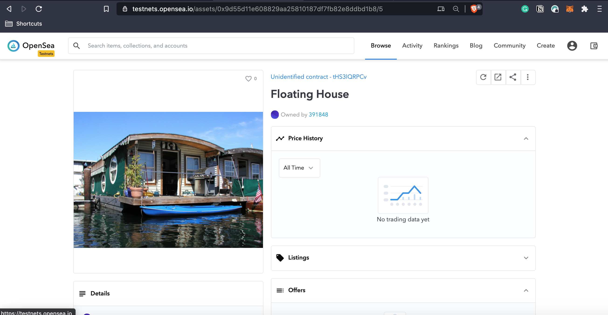
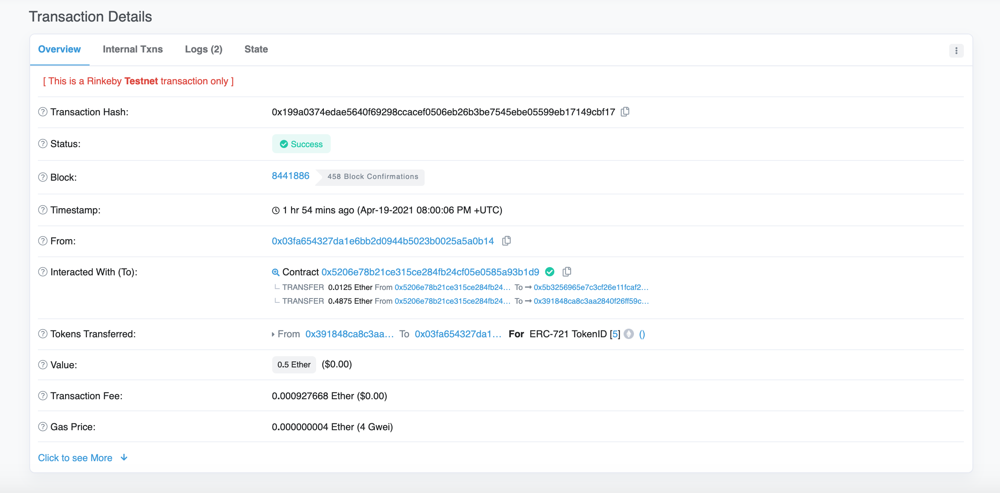
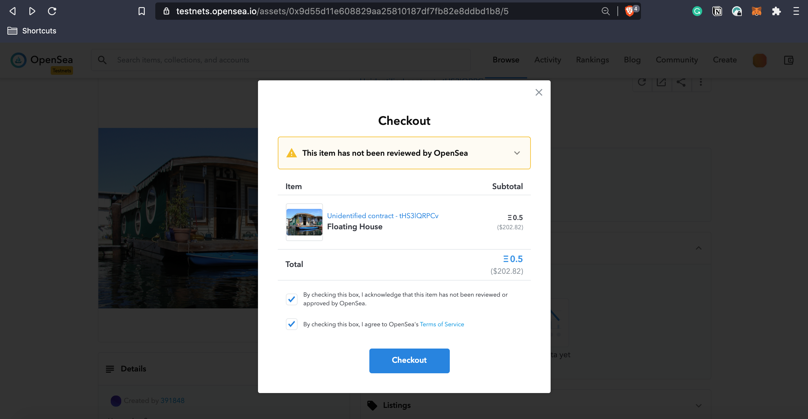
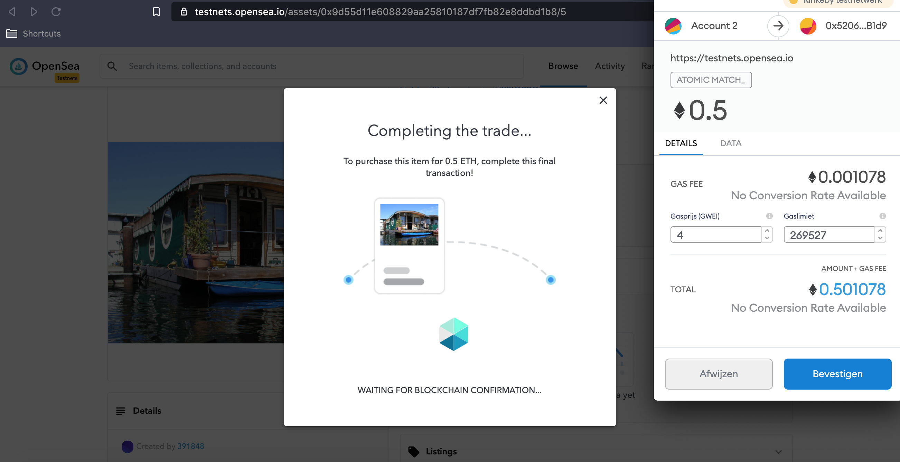
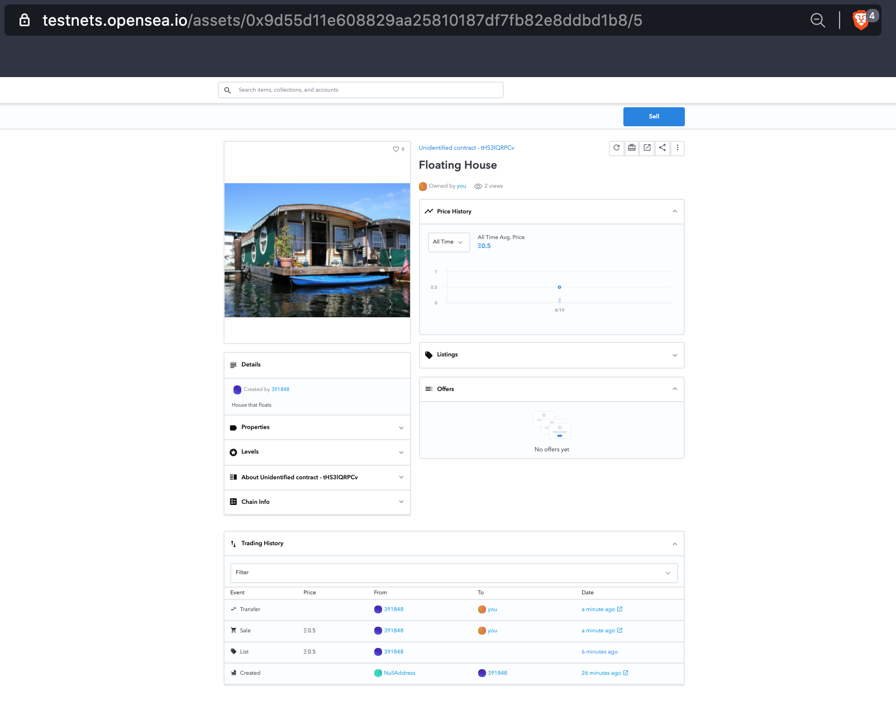

# Udacity - Capstone Project: Real Estate Marketplace

This project teaches to mint your own tokens that represent your title to the properties. Before minting a token, you need verified ownership of the property. This will be done by using zk-SNARKs to create a verification system to prove ownership without revealing specific information of that property. Zk-SNARKS provides privacy. Once the token is verified it is placed on the Rinkeby blockchain testnet and on blockchain market place OpenSea's testnet.

OpenSea is a decentralized marketplace that is used for selling for crypto assets. On OpenSea, you can buy or sell any of these items through a smart contract, meaning that no central authority ever holds custody of your items. 

## Table of Index

1. [Project Dependencies](#project-dependencies)
2. [Running Test Cases](#running-test-cases)
3. [Main Contract ABI - SolnSquareVerifier](#main-contract-abi---solnsquareverifier)
4. [Zokrates Verifier.sol Generation](#zokrates-verifiersol-generation)
5. [Multiple Proofs Generation](#multiple-proofs-generation)
6. [Project Deployment on Rinkeby](#project-deployment-on-rinkeby)
7. [Rinkeby Contracts & Tokens](#rinkeby-contracts--tokens)
8. [OpenSea Market Place NFTs](#opensea-market-place-nfts)
9. [Buying OpenSea NFT](#buying-opensea-nft)

### Project Dependencies

```shell
	Node v14.12.0
	Web3.js v1.2.9
  Truffle v5.1.61 (core: 5.1.61)
	Solidity - 0.5.2 (solc-js)
```

### Running Test Cases

1. Open Terminal in root directory of project
2. Run `npm i` to install all dependencies
3. Execute `cd eth-contracts/`
4. Execute `truffle develop` to run development truffle cli blockchain
5. Open another terminnal in root directory of project
6. Execute `cd eth-contracts/`
7. Execute `truffle test` to run all test cases present in `eth-contracts/test` folder.

Truffle Develop Output:

```shell
$ truffle develop
Truffle Develop started at http://127.0.0.1:9545/

Accounts:
(0) 0x9d8b194c9dfe775f8e9ca7e39226270c812e15a9
(1) 0xd72c0a047e1a9cec866efc00098910cd7cf356e2
(2) 0x55162b3d918a5fc9bb41968d7623645f5046f072
(3) 0x6ee9abb296ec10951faf8372ade7a7e6ec2ad83c
(4) 0x8b235660cddb6e7657e0b5c62e2af56c3316d20f
(5) 0x00f2f7ec1356e43d1ca0cbf0c07499378f8535c0
(6) 0x9c687c97e8a7af11bc861ef0b39d30806f4a61f8
(7) 0x00cbd1c9c7cff32e55afadb219a87e5580ebf67a
(8) 0x78d4a8aec0013cfa8c5f17e928cee7d99de6c790
(9) 0xfd2bee68204c576550c5733d9218848d1bcee18f

Private Keys:
(0) b83a5ec36e706aa88d9d3490ef61228e66f9939d453261961c5f34da74b05ed5
(1) f430ae72b15953242afb7b35294abef4c6a5fa376d159299e5066db76190295a
(2) cdebc8abdcbd4b428c0a4d2734f22dbb8cb6d87ee3414a33a98c971c0f28541b
(3) 562e7f23eae133e2df3eaf0c4db80a8af2974004af6e9695302da08c03299296
(4) fdf3cbcc3dafc11443364f942f6c3f0e7e5b53084673e5f952953eb2fe14f989
(5) dd9d5977773223a2ddb359d55a7fa5ef8abc9a11aac2fbbbbf5fc4830a7f68fb
(6) 1f365c80bf0601d7b7cc29ebbcdfc035011bda081daf88e54784f2ad9d1fa92a
(7) ec1070367e33a134ca5907185a648bedb7ef5285b57cf4cb669e0296ffab1db8
(8) 672b4cc0c0eef15265ff46e921c055959315dfcfc4bbdd05b5d523c534b4906b
(9) 4e56c4d0cc80e8d7bd8925c450ab57cec23b658db04a5cfd3d5b08139403b136

Mnemonic: satoshi bleak record veteran renew mimic affair oven flash measure pretty feed
```

```shell
$ truffle test

Compiling your contracts...
===========================
✔ Fetching solc version list from solc-bin. Attempt #1
✔ Downloading compiler. Attempt #1.
> Compiling ./contracts/ERC721Mintable.sol
> Compiling ./contracts/Migrations.sol
> Compiling ./contracts/Oraclize.sol
> Compiling ./contracts/SolnSquareVerifier.sol
> Compiling ./contracts/Verifier.sol
> Compiling openzeppelin-solidity/contracts/drafts/Counters.sol
> Compiling openzeppelin-solidity/contracts/math/SafeMath.sol
> Compiling openzeppelin-solidity/contracts/token/ERC721/IERC721Receiver.sol
> Compiling openzeppelin-solidity/contracts/utils/Address.sol
> Artifacts written to /var/folders/yj/fst4_wvd34q7njyczskk9h6m0000gn/T/test--2998-V1Ykc1FXHWuw
> Compiled successfully using:
   - solc: 0.5.2+commit.1df8f40c.Emscripten.clang


  Contract: TestERC721Mintable
    match erc721 spec
      ✓ should return total supply
      ✓ should get token balance (66ms)
      ✓ should return token uri (75ms)
      ✓ should transfer token from one owner to another (132ms)
    have ownership properties
      ✓ should fail when minting when address is not contract owner (459ms)
      ✓ should return contract owner

  Contract: TestSolnSquareVerifier
    Adding New Verified Solution
      ✓ Test if a new solution can be added for contract (63ms)
    Minting New Verified Token
      ✓ Test if an ERC721 token can be minted for contract (2381ms)

  Contract: TestSquareVerifier
    Test cases for Verifier contract
      ✓ Test verification with correct proof (983ms)
      ✓ Test verification with incorrect proof (960ms)


  10 passing (12s)
```

### Main Contract ABI - SolnSquareVerifier

(To get ABI for other contracts, please run `truffle compile` in `eth-contracts` folder and find it in `eth-contracts/build/contracts` folder respectively.)

### Zokrates Verifier.sol Generation

1. Start Docker Desktop
2. Execute following in terminal
```shell
cd (your main folder file)

docker run -v /Users/tomdemoor/Documents/Udacity\ Submit/Udacity\ -\ Capstone\ Project/zokrates/code -ti zokrates/zokrates /bin/bash

latest: Pulling from zokrates/zokrates
6e0aa5e7af40: Pull complete 
d47239a868b3: Pull complete 
49cbb10cca85: Pull complete 
03d70d4069d4: Pull complete 
1b17136396f1: Pull complete 
2228c6fc9a56: Pull complete 
6af9adf7c623: Pull complete 
Digest: sha256:4f94d11127133ab2c96d687cf8517b0ead98cff3a42023ee09937c81740e9beb
Status: Downloaded newer image for zokrates/zokrates:latest
```

### Multiple Proofs Generation

1. Start Docker Desktop
2. Execute following in terminal
```shell
cd (your main folder file)

docker run -v /Users/tomdemoor/Documents/Udacity\ Submit/Udacity\ -\ Capstone\ Project/zokrates/code -ti zokrates/zokrates /bin/bash
cd code/square

zokrates compile -i square.code     # compile
zokrates compute-witness -a 1 1     # Here we usually use a root and its square
zokrates generate-proof             # generate a proof of computation

zokrates compute-witness -a 2 4     # Here we usually use a root and its square
zokrates generate-proof             # generate a proof of computation

zokrates compute-witness -a 3 9     # Here we usually use a root and its square
zokrates generate-proof             # generate a proof of computation

zokrates compute-witness -a 4 16    # Here we usually use a root and its square
zokrates generate-proof             # generate a proof of computation

zokrates compute-witness -a 5 25    # Here we usually use a root and its square
zokrates generate-proof             # generate a proof of computation

zokrates compute-witness -a 6 36    # Here we usually use a root and its square
zokrates generate-proof             # generate a proof of computation

zokrates compute-witness -a 7 49    # Here we usually use a root and its square
zokrates generate-proof             # generate a proof of computation

zokrates compute-witness -a 8 64    # Here we usually use a root and its square
zokrates generate-proof             # generate a proof of computation

zokrates compute-witness -a 9 81    # Here we usually use a root and its square
zokrates generate-proof             # generate a proof of computation

zokrates compute-witness -a 10 100  # Here we usually use a root and its square
zokrates generate-proof             # generate a proof of computation
```
> After each `generate-proof` move proof.json to proofs folder and rename it as per iteration.

Above can alo be done by shell scripting but to keep things at primary level for clear understanding, rather a manual approach was chosen.

### Project Deployment on Rinkeby

```shell
$ truffle migrate --reset --network rinkeby

Compiling your contracts...
===========================
> Everything is up to date, there is nothing to compile.


Starting migrations...
======================
> Network name:    'rinkeby'
> Network id:      4
> Block gas limit: 10000000 (0x989680)


1_initial_migration.js
======================

   Deploying 'Migrations'
   ----------------------
   > transaction hash:    0xa8ddfb4286c4e8a9e8e0a1d424dcbf5d33ceafc77c27c91cb4b1c3aacaac1402
   > Blocks: 2            Seconds: 17
   > contract address:    0xfE3A8F76b0c044ACd8Ff4b85a426FCb0DE8BDAb3
   > block number:        8441724
   > block timestamp:     1618859976
   > account:             0x391848CA8c3aA2840F26fF59c8ce7AcDD743c53b
   > balance:             10.408367246
   > gas used:            236258 (0x39ae2)
   > gas price:           20 gwei
   > value sent:          0 ETH
   > total cost:          0.00472516 ETH

   Pausing for 2 confirmations...
   ------------------------------
   > confirmation number: 1 (block: 8441725)
   > confirmation number: 2 (block: 8441726)

   > Saving migration to chain.
   > Saving artifacts
   -------------------------------------
   > Total cost:          0.00472516 ETH


2_deploy_contracts.js
=====================

   Deploying 'Verifier'
   --------------------
   > transaction hash:    0xb0609bc0b5dfa48d71491eb18c50bd8b74dfb97ff2612d26771e8aed7de1ee70
   > Blocks: 1            Seconds: 12
   > contract address:    0x7b2A09e5c0dBAc7dF4c4340ce9c95ECdf6A95D6a
   > block number:        8441728
   > block timestamp:     1618860036
   > account:             0x391848CA8c3aA2840F26fF59c8ce7AcDD743c53b
   > balance:             10.387214566
   > gas used:            1011866 (0xf709a)
   > gas price:           20 gwei
   > value sent:          0 ETH
   > total cost:          0.02023732 ETH

   Pausing for 2 confirmations...
   ------------------------------
   > confirmation number: 1 (block: 8441729)
   > confirmation number: 2 (block: 8441730)

   Deploying 'SolnSquareVerifier'
   ------------------------------
   > transaction hash:    0xa4c0fd08824767f063c48bc911546315531184867ea63c00b00157f76db43d53
   > Blocks: 0            Seconds: 8
   > contract address:    0x9d55d11E608829Aa25810187Df7fb82e8dDbD1B8
   > block number:        8441731
   > block timestamp:     1618860081
   > account:             0x391848CA8c3aA2840F26fF59c8ce7AcDD743c53b
   > balance:             10.317984506
   > gas used:            3461503 (0x34d17f)
   > gas price:           20 gwei
   > value sent:          0 ETH
   > total cost:          0.06923006 ETH

   Pausing for 2 confirmations...
   ------------------------------
   > confirmation number: 1 (block: 8441732)
   > confirmation number: 2 (block: 8441733)

   > Saving migration to chain.
   > Saving artifacts
   -------------------------------------
   > Total cost:          0.08946738 ETH


Summary
=======
> Total deployments:   3
```


### Rinkeby Contracts & Tokens

**Smart Contracts**

| Verifier Contract           | [0xfE3A8F76b0c044ACd8Ff4b85a426FCb0DE8BDAb3](https://rinkeby.etherscan.io/address/0xfE3A8F76b0c044ACd8Ff4b85a426FCb0DE8BDAb3) |
| --------------------------- | ------------------------------------------------------------ |
| SolnSquareVerifier Contract | [0x9d55d11E608829Aa25810187Df7fb82e8dDbD1B8](https://rinkeby.etherscan.io/address/0x9d55d11E608829Aa25810187Df7fb82e8dDbD1B8) |

**Minted Tokens**

```shell
$ node mint.js
Minted Token 0 Tx Hash : 0xd432323cad79e8fa8ce25de3e79029f6aaec3e4345f9fddbb70af211767baa03
Minted Token 1 Tx Hash : 0x1bd8c167c2100892ff7208529c28b61f30c0aeb43c56ee67f2bde750d1846020
Minted Token 2 Tx Hash : 0xb872a1d69b6dc74a48503378839204559c447f1ed7672e9bb15211c926181136
Minted Token 3 Tx Hash : 0x9eb6cb881c25189377ef44daae371a4c674d8374d08e3155ee05a6fc0b264d0e
Minted Token 4 Tx Hash : 0x9b301cd01a90d765e049fc99cf870fb871a67d460c396887d8267b39e65e9b1a
Minted Token 5 Tx Hash : 0x23b614bcecd89e584a3c9efa275823801fd62fd0ed3332cd92ae2e9b5ff10844
Minted Token 6 Tx Hash : 0xae56b4689759da8c4d8ba84995ea1698d23d6d1884163fc267ed1d2257c8708f
Minted Token 7 Tx Hash : 0x968ca8e646bb7bff2e602345272fa6b8c39160ba6ac26d799ac235474d021ab2
Minted Token 8 Tx Hash : 0x06ab4f178c7e3006f44351af46823aefa64cee7d8aecdbb374ae86babcc6cd1e
Minted Token 9 Tx Hash : 0xae070a015096fc0a69b7d17031dc8b2ee3e868fe2b251f777df6bfa6098c25c0
```

### OpenSea Market Place NFTs

1. https://testnets.opensea.io/assets/0xa535BE600BfD7401101b7377Fb994B583581fB14/0

   

2. Remaining 4 NFTs Purchase Transactions are below:
https://testnets.opensea.io/accounts/0x391848ca8c3aa2840f26ff59c8ce7acdd743c53b

### Buying OpenSea NFT

tokenID5 - https://rinkeby.etherscan.io/tx/0x199a0374edae5640f69298ccacef0506eb26b3be7545ebe05599eb17149cbf17



Buying: https://testnets.opensea.io/assets/0x9d55d11e608829aa25810187df7fb82e8ddbd1b8/5








